# Use the Force, Luke!

> A speculative-physics framework for generating artificial gravity fields, integrating trajectories through them, and evaluating propulsion capability across six vehicle scales — from a 12 kg CubeSat to a billion-kilogram metropolitan city ship.

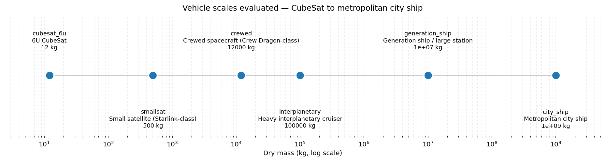

## What this is

Inspired by [Avi Loeb's question](https://avi-loeb.medium.com/can-the-vacuum-drive-fuel-free-propulsion-e4983a86419c) — *can the vacuum drive fuel-free propulsion?* — this project explores six avenues toward gravity nullification:

- **Casimir effect** scaled to useful force ranges, trading fuel efficiency for propulsion power
- **Exotic quantum-field shaping** via radioactive decay, stimulated emission, and fine nano-structure emitters
- **Antimatter conversion** of energy directly into counter-gravity forces
- **Quark–gluon plasma** as a confined power source feeding graviton emission
- **Blackhole explorer** — Schwarzschild gravity (anchored) paired with an exceptionally-speculative counter-drive, to *quantify the propulsion shortfall* near an event horizon — extended with an optional **negative-mass buffer** between craft and horizon (see [Loeb 2024](https://avi-loeb.medium.com/negative-mass-binaries-generate-never-seen-before-gravitational-radiation-6f5fa8bfa68d))
- **Negative-mass binaries** — Bondi runaway pair (Forward 2015 propulsion), anti-chirp gravitational radiation, unstable repulsive binaries, dipole-GW radiator (WEP violation), and a negative-mass point source primitive used by the blackhole buffer

The premises are deliberately speculative; the math, units, and conservation checks are not. Two real-physics anchors (parallel-plate Casimir and Schwarzschild geometry) keep the framework calibrated; everything else is a clearly-marked parametric ansatz tested against its known limits.

## Architecture at a glance

The whole framework hangs off one protocol: every propulsion model is a `ForceField`, and every consumer (trajectories, missions, visualisation) takes one. Adding a new mechanism is one class.

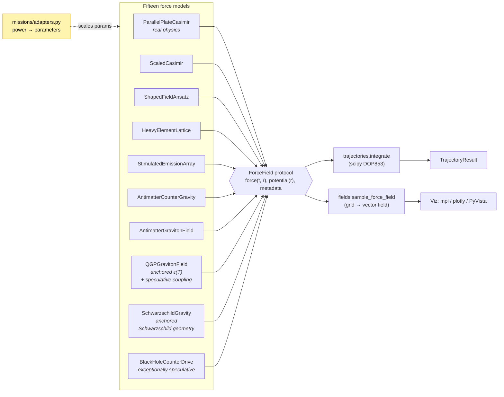
```mermaid
flowchart LR
    subgraph Avenues["Fifteen force models"]
        C1["ParallelPlateCasimir<br/><i>real physics</i>"]
        C2[ScaledCasimir]
        Q1[ShapedFieldAnsatz]
        Q2[HeavyElementLattice]
        Q3[StimulatedEmissionArray]
        A1[AntimatterCounterGravity]
        A2[AntimatterGravitonField]
        QG["QGPGravitonField<br/><i>anchored ε(T)<br/>+ speculative coupling</i>"]
        BH1["SchwarzschildGravity<br/><i>anchored<br/>Schwarzschild geometry</i>"]
        BH2["BlackHoleCounterDrive<br/><i>exceptionally speculative</i>"]
    end
    P{{"ForceField protocol<br/>force(t, r), potential(r), metadata"}}
    C1 --> P
    C2 --> P
    Q1 --> P
    Q2 --> P
    Q3 --> P
    A1 --> P
    A2 --> P
    QG --> P
    BH1 --> P
    BH2 --> P
    P --> T["trajectories.integrate<br/>(scipy DOP853)"]
    P --> S["fields.sample_force_field<br/>(grid → vector field)"]
    T --> R[TrajectoryResult]
    S --> V[Viz: mpl / plotly / PyVista]
    M["missions/adapters.py<br/>power → parameters"]:::spec -.scales params.-> Avenues
    classDef spec fill:#fff3b0,stroke:#d4a017,color:#000
```

The yellow box is where speculative scaling enters: `missions/adapters.py` is the *only* place vehicle power is mapped to model parameters, and every adapter prints its assumptions next to the result.

### Object graph

The framework's primary types and their relationships:

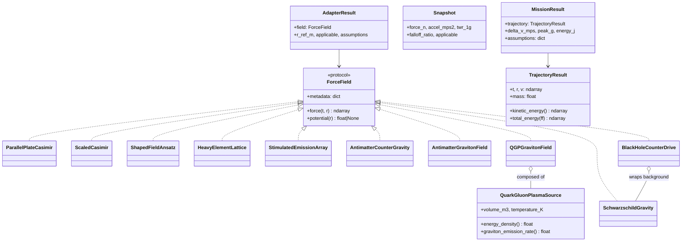
```mermaid
classDiagram
    class ForceField {
        <<protocol>>
        +metadata: dict
        +force(t, r) ndarray
        +potential(r) float|None
    }
    class ParallelPlateCasimir
    class ScaledCasimir
    class ShapedFieldAnsatz
    class HeavyElementLattice
    class StimulatedEmissionArray
    class AntimatterCounterGravity
    class AntimatterGravitonField
    class QGPGravitonField
    class SchwarzschildGravity
    class BlackHoleCounterDrive
    ForceField <|.. ParallelPlateCasimir
    ForceField <|.. ScaledCasimir
    ForceField <|.. ShapedFieldAnsatz
    ForceField <|.. HeavyElementLattice
    ForceField <|.. StimulatedEmissionArray
    ForceField <|.. AntimatterCounterGravity
    ForceField <|.. AntimatterGravitonField
    ForceField <|.. QGPGravitonField
    ForceField <|.. SchwarzschildGravity
    ForceField <|.. BlackHoleCounterDrive

    class QuarkGluonPlasmaSource {
        +volume_m3, temperature_K
        +energy_density() float
        +graviton_emission_rate() float
    }
    QGPGravitonField o-- QuarkGluonPlasmaSource : composed of
    BlackHoleCounterDrive o-- SchwarzschildGravity : wraps background

    class TrajectoryResult {
        +t, r, v: ndarray
        +mass: float
        +kinetic_energy() ndarray
        +total_energy(ff) ndarray
    }
    class AdapterResult {
        +field: ForceField
        +r_ref_m, applicable, assumptions
    }
    class Snapshot {
        +force_n, accel_mps2, twr_1g
        +falloff_ratio, applicable
    }
    class MissionResult {
        +trajectory: TrajectoryResult
        +delta_v_mps, peak_g, energy_j
        +assumptions: dict
    }
    AdapterResult --> ForceField
    MissionResult --> TrajectoryResult
```

## The fifteen force models

**Anchored** (textbook physics, used as calibration):

| Avenue | Model | Anchor |
| --- | --- | --- |
| `casimir` | `ParallelPlateCasimir` | textbook Casimir 1948 formula `F/A = -π²ℏc/(240a⁴)` |
| `blackhole` | `SchwarzschildGravity` | Schwarzschild 1916; `r_s = 2GM/c²`, Newtonian potential `-GMm/R` (optional GR hover factor `1/√(1−r_s/R)`) |

**Speculative** (clearly-marked parametric ansätze, each pinned by a known limit):

| Avenue | Model | Known limit / anchor |
| --- | --- | --- |
| `casimir` | `ScaledCasimir` | parallel-plate × geometry factor `g` |
| `qfield` | `ShapedFieldAnsatz` | Gaussian-well potential, `U(r) = -A·exp(-|r|²/(2σ²))` |
| `qfield` | `HeavyElementLattice` | Plummer-softened multi-site dipole sum; single-site → 1/r² |
| `qfield` | `StimulatedEmissionArray` | coherent phased-array intensity; single-emitter → `A²/r²` |
| `antimatter` | `AntimatterCounterGravity` | local cancellation of supplied background `g(r)` |
| `antimatter` | `AntimatterGravitonField` | Yukawa `-g·Γ·e^{-r/λ}/r`; `λ → ∞` limit → 1/r² |
| `qgp` | `QGPGravitonField` | Stefan–Boltzmann `ε(T) = (π²/30)·g_eff(T)·(k_BT)⁴/(ℏc)³` (*anchored*, lattice-flavoured) × Yukawa graviton (*speculative* coupling) |
| `blackhole` | `BlackHoleCounterDrive` | local cancellation of supplied Schwarzschild `g(r)`, capped at `η ≤ 1` — *exceptionally* speculative; exists to quantify the shortfall |
| `negmass` | `BondiRunawayPair` | Bondi 1957 zero-net-mass pair, constant body acceleration `G·\|m_neg\|/d²` (Forward 2015 propulsion claim) |
| `negmass` | `AntiChirpBinary` | positive-total-mass with one negative component → orbit *expands*, GW `df/dt < 0` (Peters–Mathews with sign reversal; Loeb 2024) |
| `negmass` | `NegativeTotalMassBinary` | repulsive, unbound; raises at `t_break = π·√(d³/G\|M\|)` |
| `negmass` | `DipoleGravitonRadiator` | dipole GW pattern `∝ cos θ` if equivalence principle fails for the negative-mass component |
| `negmass` | `NegativeMassPointSource` | sign-flipped Newtonian point source; used by the blackhole-buffer extension to push the craft outward |

Field arithmetic is one new public class, **`CompositeField(*components)`** — vector sum of any `ForceField` instances. Metadata aggregates: `speculative` is OR-over-components, `speculative_components` is the sorted set-union, `applicable_for_trajectory` is AND, and `potential()` returns `None` if any component is non-conservative.

Every speculative model carries `metadata["speculative"] = True` and a `metadata["speculative_components"]` list naming the speculative knobs; tests assert these markers so they can't be silently dropped during refactors.

## Quickstart

```bash
pip install -e ".[dev,viz,interactive,3d]"   # core + matplotlib + plotly + pyvista
pytest -q                                     # full test suite, all green
python notebooks/02_evaluation.py             # writes results/ for the eval matrix
```

Optional extras (each lazy-imports its heavy dep so missing one only fails when actually called):
- `viz` — matplotlib (static figures)
- `interactive` — plotly (browser-interactive 2D/3D)
- `3d` — pyvista + trame (3D animation of fields and trajectories)

## What the framework does

### Symbolic + numerical co-validation

SymPy expressions in `src/usetheforce/symbolic/` are the *source of truth* for each model's analytic structure. Numerical kernels are either generated from them via `lambdify` or cross-checked against them in tests.

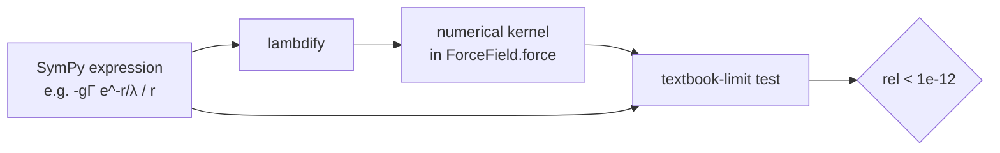
```mermaid
flowchart LR
    SP[SymPy expression<br/>e.g. -gΓ e^-r/λ / r] --> LB[lambdify]
    LB --> NK[numerical kernel<br/>in ForceField.force]
    NK --> T1[textbook-limit test]
    SP --> T1
    T1 --> OK{rel < 1e-12}
```

### Trajectories through shaped fields

`trajectories.integrate(ff, mass, r0, v0, t_span)` wraps `scipy.integrate.solve_ivp` (DOP853, rtol = 1e-10). Returns a `TrajectoryResult` with `t, r, v` plus `kinetic_energy()` and `total_energy(ff)` (the latter requires the field to expose a potential). Conservation tests use `hypothesis` to verify energy drift stays below 1e-6 over a parameter sweep.

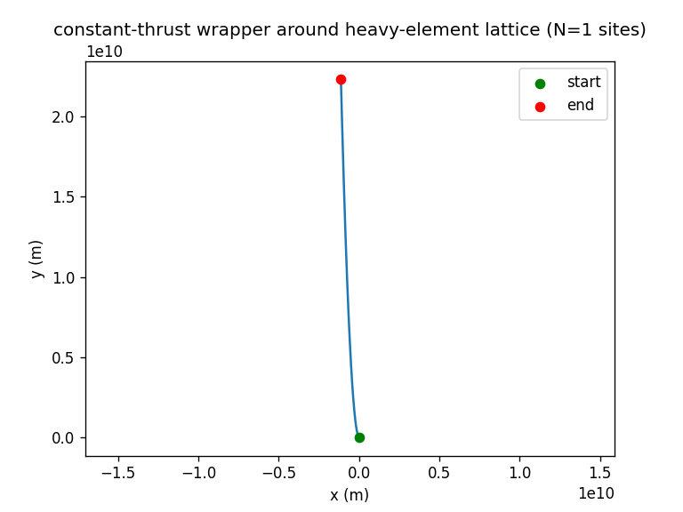

### Numerical rigour — actual conservation drift

The "<1e-6 energy drift" claim, plotted directly. For each conservative speculative model, integrate one full circular orbit and watch the relative drift `|ΔE/E₀|`:

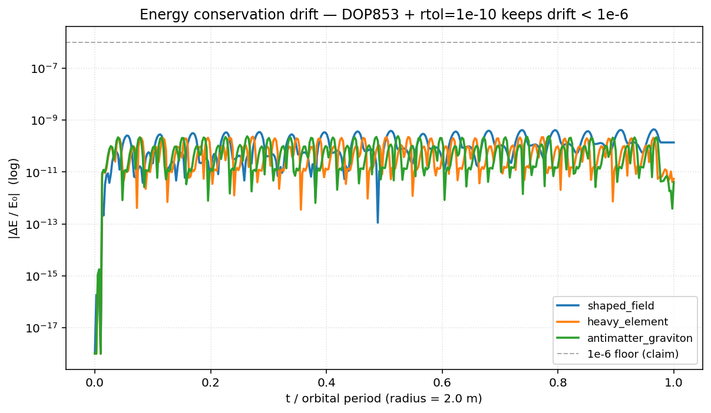

DOP853 with `rtol=1e-10` keeps `|ΔE/E₀|` **at the 10⁻¹⁰ level** — five orders of magnitude below the claimed floor. The framework is honest about its numerics.

### Anchored physics — the QGP deconfinement crossover

The QGP avenue's energy density follows Stefan–Boltzmann thermodynamics with a lattice-QCD-flavoured `g_eff(T)` that interpolates between the hadron-resonance gas (`g_HRG ≈ 3`) and the deconfined plasma (`g_QGP ≈ 47.5`) via a tanh of width `ΔT ≈ 20 MeV` centred on the lattice value `T_c ≈ 155 MeV`:

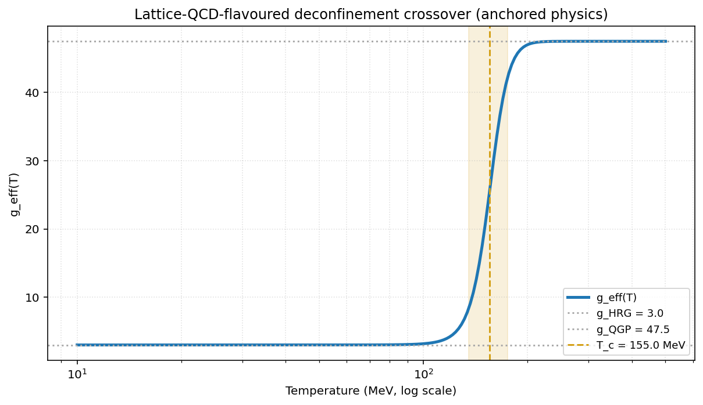

Above `T_c + 2 ΔT` the curve sits on the QGP plateau — that's where the missions adapter pins the operating point so the energy density is well-defined. The graviton coupling that turns this anchored energy density into thrust remains speculative; that part lives in `QuarkGluonPlasmaSource.metadata["speculative_components"]`.

### Three-tier visualisation

| Tier | Use | Backend |
| --- | --- | --- |
| `viz/mpl.py` | static publication figures, derivation diagnostics | matplotlib |
| `viz/plotly_3d.py` | browser-interactive 2D/3D plots | plotly |
| `viz/pyvista_3d.py` | 3D animation of fields + trajectories | PyVista + VTK + trame |

PyVista is the canonical *"watch the field evolve while the craft moves through it"* tool — `animate_trajectory_in_field` renders glyph fields, energy isosurfaces, and the moving craft together as a GIF or interactive scene.

### 2D animations — thrust + trajectory

For 2D capability storytelling, `viz/control_animations.py` produces matplotlib `FuncAnimation` GIFs of `LongRangeMissionResult` data — no extra system dependency beyond matplotlib + pillow. Two helpers, both regenerable via `python notebooks/05_animations.py`:

`animate_long_range_mission` — animated 2×2 dashboard. Trajectory + thrust magnitude + power reserve + accumulated Δv, all synced by a moving cursor. The trajectory panel also carries a yellow line indicating instantaneous thrust direction at each frame:

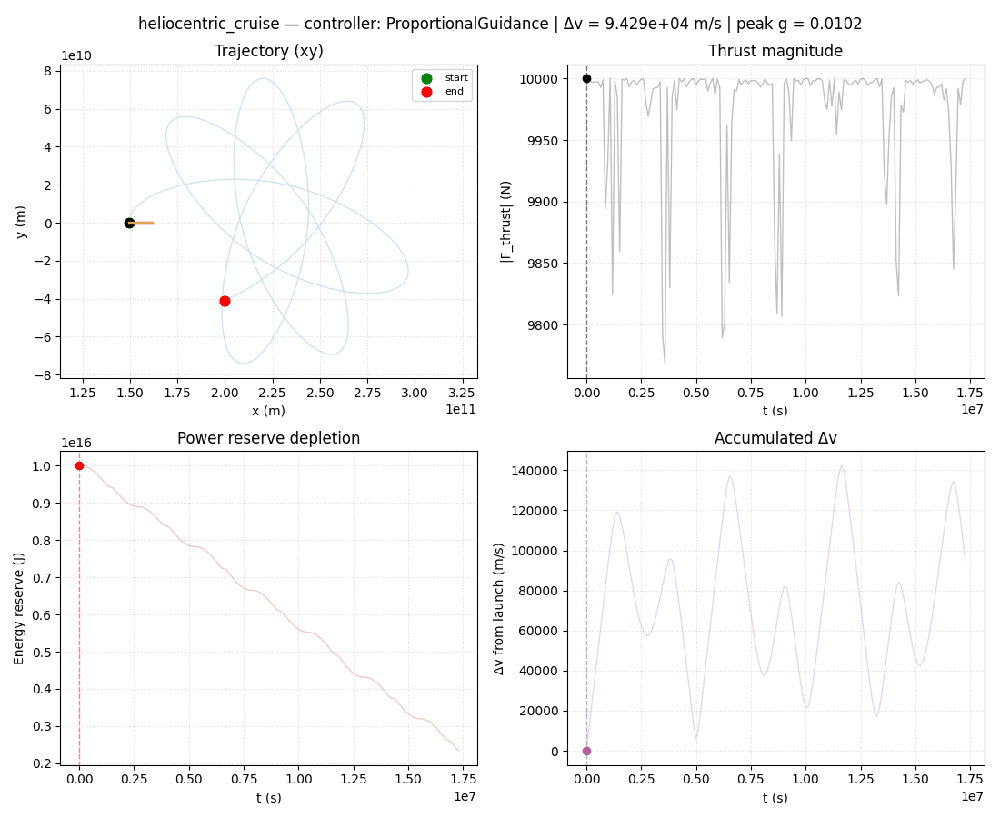

`animate_model_comparison` — side-by-side runs of the same mission with different propulsion-capability levels, normalised onto a shared time axis. Below: the same Earth → Mars heliocentric cruise, three thrust ceilings (1 kN / 10 kN / 100 kN). The capability hierarchy is the point — at low thrust the trajectory barely curves; at high thrust it heads aggressively toward Mars:

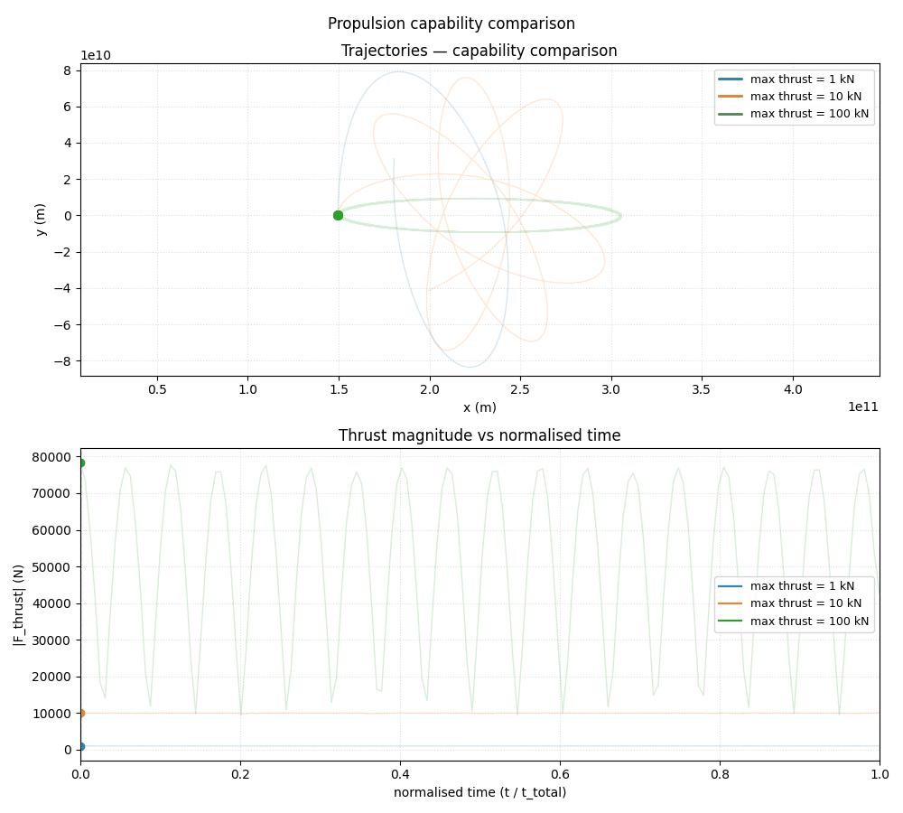

## Vehicle scales evaluated

| Vehicle | Description | Mass | Power budget |
| --- | --- | ---: | ---: |
| `cubesat_6u` | 6U CubeSat | 12 kg | 30 W |
| `smallsat` | Small satellite (Starlink-class) | 500 kg | 714 W |
| `crewed` | Crewed spacecraft (Crew Dragon-class) | 12 t | 10.6 kW |
| `interplanetary` | Heavy interplanetary cruiser | 100 t | 64.5 kW |
| `generation_ship` | Generation ship / large station | 10 000 t | 3.23 MW |
| `city_ship` | Metropolitan city ship | 1 000 000 t | 162 MW |

Power scales sub-linearly with mass (`P ≈ 30 W · (m/12 kg)^0.85`) — bigger ships get more reactor mass per kg of payload but plateau at radiator/structure limits. Numbers are stated as engineering placeholders.

## Capability matrix

The evaluation pipeline scores every (vehicle, model) pair on a fixed-power-budget basis, then runs ODE-integrated burns for the most propulsively interesting combinations.

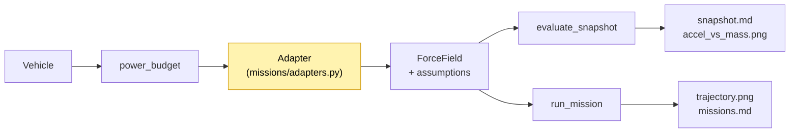
```mermaid
flowchart LR
    V[Vehicle] --> PB[power_budget]
    PB --> AD["Adapter<br/>(missions/adapters.py)"]:::spec
    AD --> FF["ForceField<br/>+ assumptions"]
    FF --> S[evaluate_snapshot]
    FF --> RM[run_mission]
    S --> RP["snapshot.md<br/>accel_vs_mass.png"]
    RM --> RM2["trajectory.png<br/>missions.md"]
    classDef spec fill:#fff3b0,stroke:#d4a017,color:#000
```

### What `run_mission` actually does

A typical call to `run_mission(vehicle, model_key, adapter, mission)` traces this path through the framework:

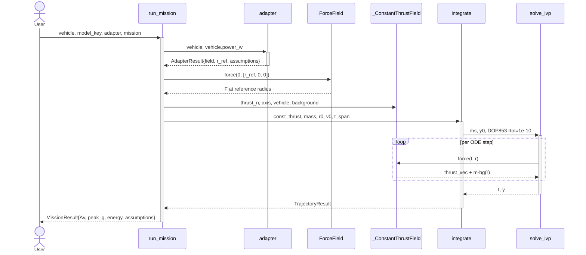
```mermaid
sequenceDiagram
    actor User
    participant run_mission
    participant adapter
    participant ForceField
    participant ConstantThrust as _ConstantThrustField
    participant integrate
    participant solve_ivp
    User->>+run_mission: vehicle, model_key, adapter, mission
    run_mission->>+adapter: vehicle, vehicle.power_w
    adapter-->>-run_mission: AdapterResult{field, r_ref, assumptions}
    run_mission->>ForceField: force(0, [r_ref, 0, 0])
    ForceField-->>run_mission: F at reference radius
    run_mission->>ConstantThrust: thrust_n, axis, vehicle, background
    run_mission->>+integrate: const_thrust, mass, r0, v0, t_span
    integrate->>+solve_ivp: rhs, y0, DOP853 rtol=1e-10
    loop per ODE step
        solve_ivp->>ConstantThrust: force(t, r)
        ConstantThrust-->>solve_ivp: thrust_vec + m·bg(r)
    end
    solve_ivp-->>-integrate: t, y
    integrate-->>-run_mission: TrajectoryResult
    run_mission-->>-User: MissionResult{Δv, peak_g, energy, assumptions}
```

The mission runner reduces the speculative model to its peak `|F|` at the adapter's reference radius and applies it as constant body-frame thrust through `_ConstantThrustField`. If you want the probe to actually fly *through* a model's spatial field, call `trajectories.integrate(model_force_field, …)` directly.

### Thrust-to-weight grid

By construction (matched-power, fixed reference radius), the four applicable models give *identical* peak acceleration for a given vehicle. The Casimir variants are correctly flagged inapplicable: their cavity force is internal and produces no centre-of-mass thrust.

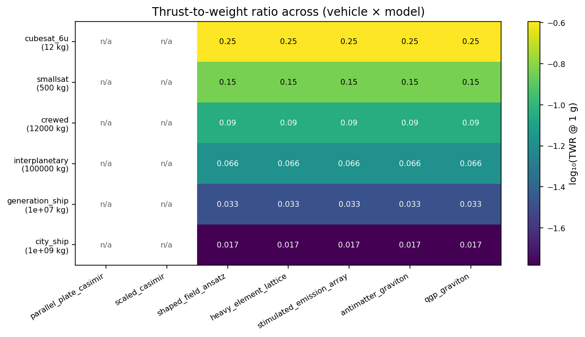

None of the configurations achieves lift-off from rest under Earth gravity (TWR < 1 everywhere) — this surfaces immediately the engineering reality that *power*, not exotic mechanism, is the binding constraint at every scale.

### Where the models actually differ: falloff with distance

Acceleration matches across models because we matched the input power. The genuine physical distinction lives in the **falloff law** — how much force survives at long range:

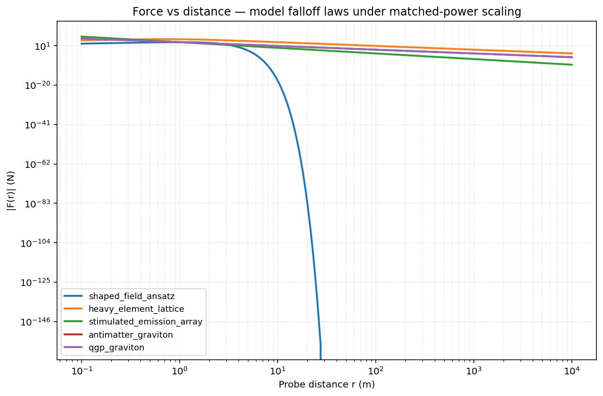

- **`shaped_field_ansatz`** (blue) collapses past a few σ — Gaussian wells are useless beyond their characteristic scale.
- **`stimulated_emission_array`** (green) decays as 1/r³ for the radiation force — workable at moderate range, loses out far away.
- **`antimatter_graviton`** (red) follows Yukawa with screening length λ = 10⁶ m — effectively 1/r² in the regime shown.
- **`heavy_element_lattice`** (orange) is also 1/r² (softened Coulomb) — comparable reach to graviton in this configuration.

This figure is the single most important comparison the framework produces: at matched input power, *the long-range mechanism wins*.

#### Yukawa screening sweep — λ → ∞ recovers inverse-square

The "Yukawa effectively 1/r² inside its screening length" claim, plotted directly. For the antimatter graviton with `Γ = g = m_probe = 1`, sweep λ over five decades:

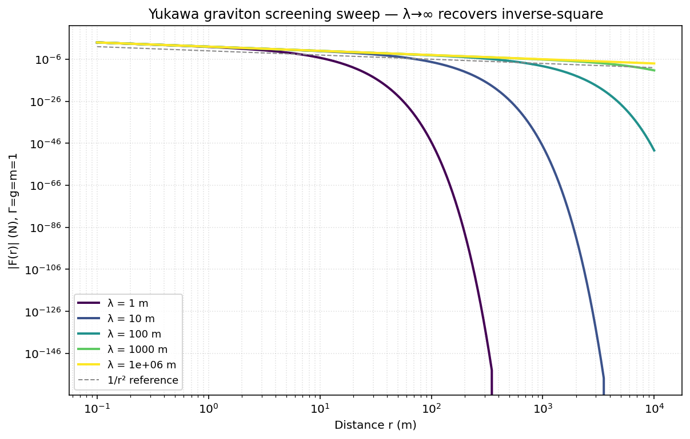

The exponential cut-off bites at distances comparable to λ. At λ = 10⁶ m (the missions adapter's default) the curve traces the dashed `1/r²` reference all the way out to 10 km — that's why the falloff comparison above places `antimatter_graviton` next to `heavy_element_lattice` (genuine 1/r²).

#### Spatial field shapes — what the falloff column abstracts

The 1D falloff curves above hide the 2D structure. Same probes evaluated on a (x, y, 0) slice with a shared logarithmic colour scale:

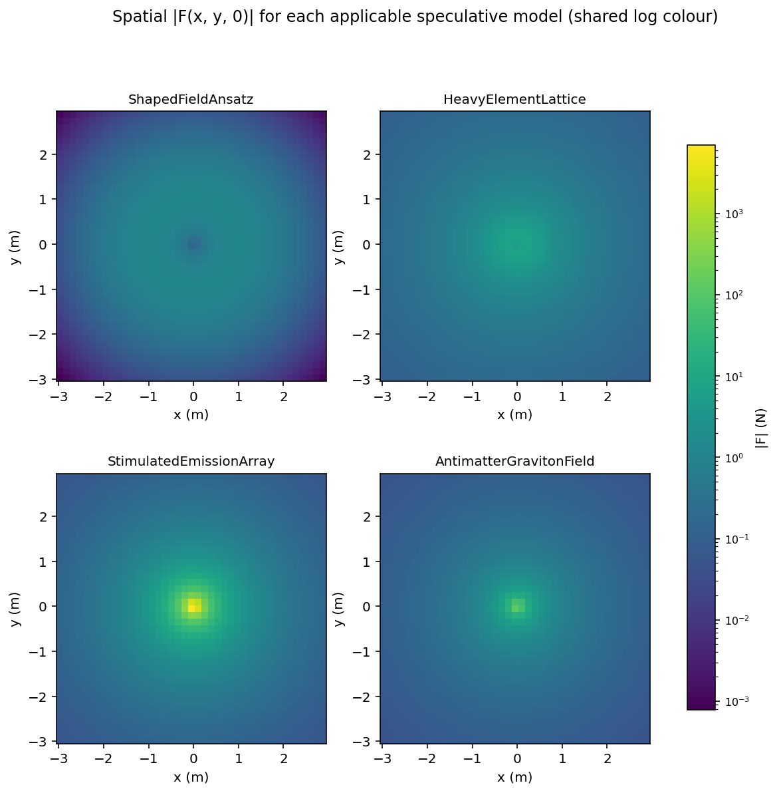

`shaped_field_ansatz` has a *vanishing* force at its centre (the Gaussian potential's minimum is a saddle for the gradient), peaks at radius σ, and dies fast. `heavy_element_lattice` is a smooth softened-Coulomb blob. `stimulated_emission_array` and `antimatter_graviton` both diverge near their sources but with different radial laws; the heatmaps make the difference visible at a glance.

## Headline results

Six (vehicle, model, mission) triples integrated end-to-end:

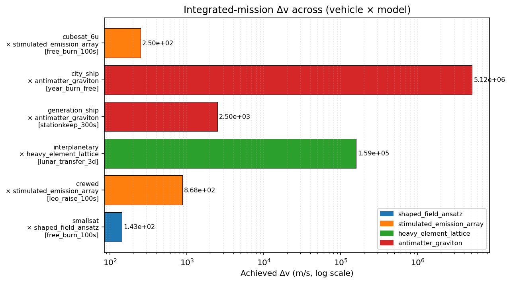

The standout: a `city_ship × antimatter_graviton` 1-year free burn reaches **5.12 × 10⁶ m/s ≈ 1.7% of c**, costing 5.1 PJ. *Reading this number requires reading the assumptions block from `results/snapshot.md`* — the result is what the framework predicts under the speculative power → annihilation-rate coupling stated there. It is not a claim about realisable efficiency.

| Mission | Vehicle | Model | Δv (m/s) | Peak g | Energy (J) |
| --- | --- | --- | ---: | ---: | ---: |
| `free_burn_100s` | cubesat_6u | stimulated_emission_array | 250 | 0.255 | 3 × 10³ |
| `free_burn_100s` | smallsat | shaped_field_ansatz | 143 | 0.146 | 7.1 × 10⁴ |
| `leo_raise_100s` | crewed | stimulated_emission_array | 868 | 0.090 | 1.1 × 10⁶ |
| `lunar_transfer_3d` | interplanetary | heavy_element_lattice | 1.59 × 10⁵ | 0.066 | 1.7 × 10¹⁰ |
| `stationkeep_300s` | generation_ship | antimatter_graviton | 2 500 | 0.033 | 9.7 × 10⁸ |
| `year_burn_free` | city_ship | antimatter_graviton | **5.12 × 10⁶** | 0.017 | **5.1 × 10¹⁵** |

## Blackhole explorer — the propulsion shortfall near r_s

The newest avenue is the framework's most extreme stress test. Schwarzschild geometry is anchored physics (`r_s = 2GM/c²`, Newtonian potential `-GMm/R`); on top of it, `SchwarzschildGravity` exposes an optional GR proper-acceleration "hover factor" `1/√(1−r_s/R)` that diverges as a stationary observer approaches the horizon. The companion `BlackHoleCounterDrive` is *exceptionally* speculative — no known mechanism couples directly to local `g` to produce an equal-and-opposite reaction force — and exists for one purpose: to quantify the gap between what a vehicle's power budget can supply and what hovering near the horizon would require.

The headline plot shows that gap directly. Three vehicles span the catalogue (CubeSat → interplanetary cruiser → city ship); for each, the required Newtonian hover thrust `GMm/R²` and the GR-corrected counterpart are drawn against `R/r_s`. The dotted horizontal is supplied thrust (`power / V_REF` at the framework's 1 m/s reference). Even the metropolitan city ship at 162 MW sits orders of magnitude below the required curve, and the GR factor pushes it further away as `R → r_s`:

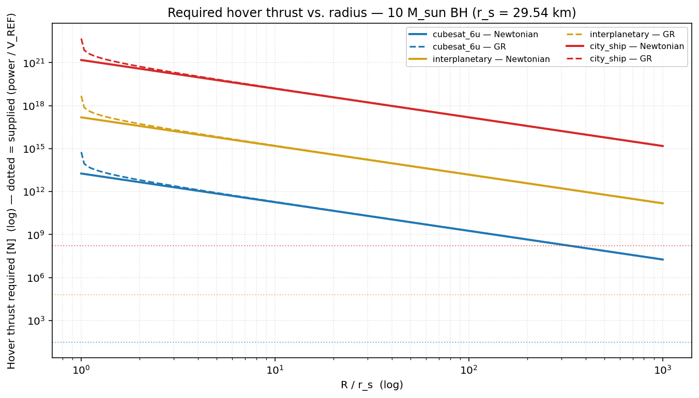

The shortfall matrix presents the same information as `log₁₀(required / supplied)` over the full vehicle catalogue and a representative `R/r_s` sweep. Every cell is positive — every vehicle is in shortfall at every plotted radius — and the number tells you by how many orders of magnitude:

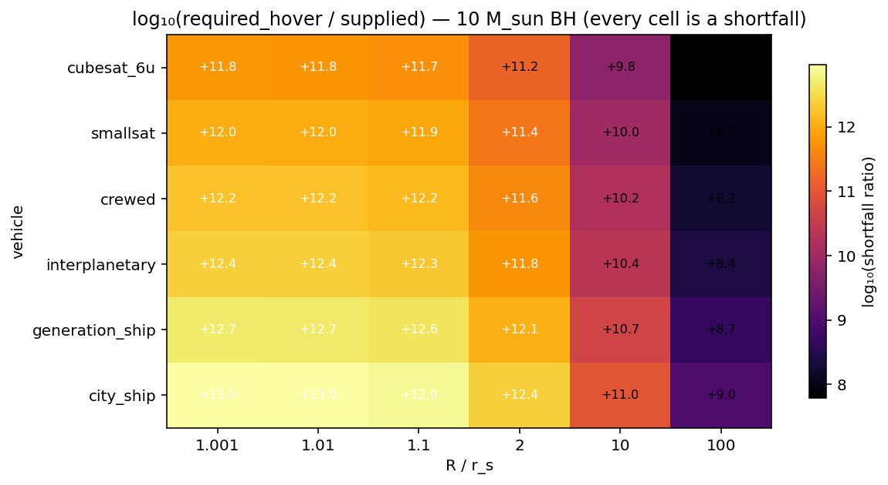

Spatially, the Schwarzschild force on an xy-slice peaks at the horizon (red circle) and decays as `1/R²` outside. Inside the horizon the helper paints `NaN` — the model raises rather than silently producing garbage:

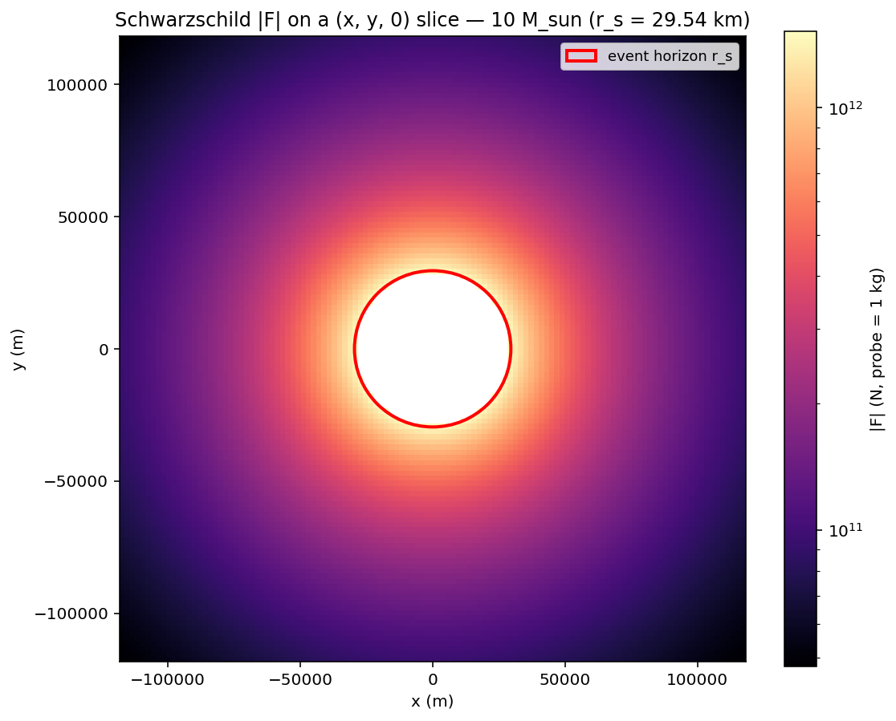

The integrated mission `event_horizon_stationkeep` builds a `ControlledThrustField` against the Schwarzschild background and runs the existing proportional-guidance controller. The animation below is the canonical 2×2 dashboard for a `city_ship` hovering at `R = 1.5 r_s`. The controller is granted a synthetic 10× the required hover thrust — a deliberate visualisation fudge so the dashboard shows a stable hover rather than an immediate plunge — and the supertitle quotes the actual supplied vs. required magnitudes alongside the shortfall ratio:

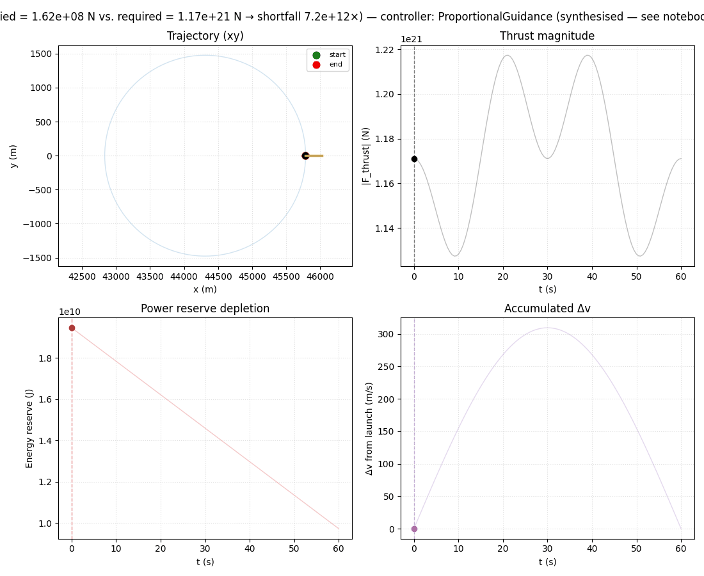

> This is the framework's most extreme stress test. Read the `BlackHoleCounterDrive.metadata["citation"]` and the adapter's `assumptions["hover_shortfall_ratio"]` before quoting any number from this section. `notebooks/06_blackhole_explorer.py` reproduces the thrust table and the GR comparison for arbitrary BH masses.

### Extension: a negative-mass buffer between craft and horizon

Inspired by [Loeb 2024](https://avi-loeb.medium.com/negative-mass-binaries-generate-never-seen-before-gravitational-radiation-6f5fa8bfa68d) on negative-mass binaries, the framework now supports a *composite-structure* augmentation of the blackhole explorer: place a negative-mass point element (`NegativeMassPointSource`) between the craft and the event horizon. Its repulsive gravity (sign-flipped Newtonian; requires the Bondi 1957 negative-inertial-mass premise) pushes the craft outward, partially cancelling Schwarzschild attraction. `event_horizon_stationkeep_with_buffer` reports four numbers worth reading together: `required_hover_force_newtonian_n` and `_gr_n` (the no-buffer reference), `buffer_repulsion_at_craft_n` (the outward push the buffer provides at the hover radius), and `buffer_offset_ratio = F_buf / F_BH` together with `augmented_shortfall_ratio = max(0, F_BH − F_buf) / supplied`. Roughly, the buffer mass needed for full cancellation at the hover radius `R_craft` with buffer–craft gap `Δ` is `m_buf ≈ M_BH · (Δ / R_craft)²`. Below that, the buffer barely dents the shortfall; above it, the speculative leap has migrated from "we have a counter-drive" to "we have a stellar-mass negative-mass appendage". The `06_blackhole_explorer.py` demo runs a buffer-mass scan that prints both ratios across six orders of magnitude.

## Where speculative assumptions live

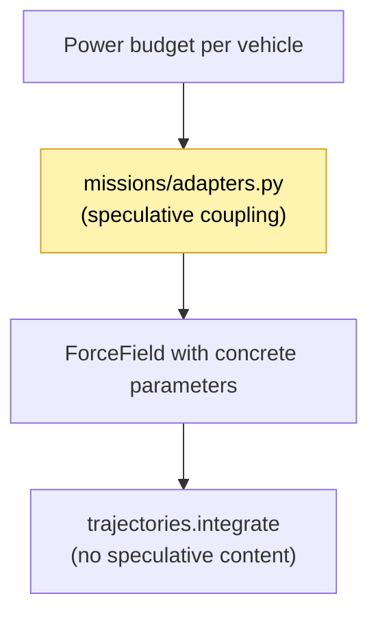
```mermaid
flowchart TB
    P[Power budget per vehicle] --> AD["missions/adapters.py<br/>(speculative coupling)"]:::spec
    AD --> FF[ForceField with concrete parameters]
    FF --> CONS["trajectories.integrate<br/>(no speculative content)"]
    classDef spec fill:#fff3b0,stroke:#d4a017,color:#000
```

The speculative leap — "given X watts, the model gets parameter Y" — is concentrated in one file, `missions/adapters.py`. Every adapter returns an `AdapterResult` whose `assumptions` dict is printed verbatim at the bottom of `results/snapshot.md`. So if a number in the report looks suspicious, the trail is one file deep.

**Anchored vs speculative inside one model.** The QGP avenue is the first to mix anchored physics with a speculative coupling within a *single* `ForceField`. The energy density `ε(T)` follows Stefan–Boltzmann with a lattice-QCD-flavoured `g_eff(T)` crossover at `T_c ≈ 155 MeV` — that part is textbook QGP thermodynamics. The conversion of QGP energy throughput into a graviton emission rate is *speculative*; the source's metadata lists `containment_efficiency`, `graviton_yield`, and `graviton_energy_quantum_J` as the speculative knobs. Together they sit in `QuarkGluonPlasmaSource.metadata["speculative_components"]` so the seam is unambiguous at runtime.

## Demos

Three runnable scripts under `notebooks/`:

| Script | What it does |
| --- | --- |
| `00_demo.py` | Build a `ShapedFieldAnsatz`, integrate a trajectory, render with all three viz tiers |
| `01_extended_models.py` | Demos for the three newer models (heavy-element lattice, stimulated-emission array, antimatter graviton) |
| `02_evaluation.py` | Full vehicle×model evaluation: writes `results/snapshot.md`, `accel_vs_mass.png`, per-mission `mission_*.{png,html}` |
| `03_documentation_figures.py` | Regenerates the README's curated figures into `assets/` |
| `04_technical_figures.py` | Regenerates the technical/physics figures into `assets/` (g_eff crossover, Yukawa sweep, conservation drift, field heatmaps, blackhole required-thrust / shortfall / field-heatmap) |
| `05_animations.py` | Regenerates the README's animated GIFs (heliocentric dashboard, capability comparison, blackhole stationkeep) into `assets/` |
| `06_blackhole_explorer.py` | Blackhole explorer: shortfall table + GR comparison; runs `event_horizon_stationkeep` and writes `assets/blackhole_explorer.png`. Now also runs a *negative-mass buffer* scan via `event_horizon_stationkeep_with_buffer` |
| `07_negative_mass_binaries.py` | Negmass demo: prints the speculative-components breakdown for each of the five sub-models, runs `bondi_runaway_cruise`, and demonstrates a `CompositeField` bolting a Bondi appendage onto an antimatter-graviton drive |

## Working style

- **Derivations before code.** Land the SymPy derivation (with limiting-case tests) before the numerical implementation. The numerical version is generated from or cross-checked against the symbolic one.
- **Validate against known limits.** Every new force model needs a test recovering a textbook result — parallel-plate Casimir, Newtonian/Kepler, λ→∞ Yukawa, single-emitter intensity, and so on.
- **Speculative ≠ sloppy.** The premises are speculative; the math, units, and conservation checks are not. Drift here defeats the entire point of the project.

See `CLAUDE.md` for full conventions. Layout: `src/usetheforce/{casimir, qfield, antimatter, qgp, blackhole, negmass}` (the avenues), `composite.py` (`CompositeField`, the avenue-agnostic field-sum seam), `fields/` (grids + Laplacian), `trajectories/` (ODE integration), `symbolic/` (SymPy expressions), `viz/` (three tiers), `missions/` (vehicles, adapters, snapshot, mission runner).
